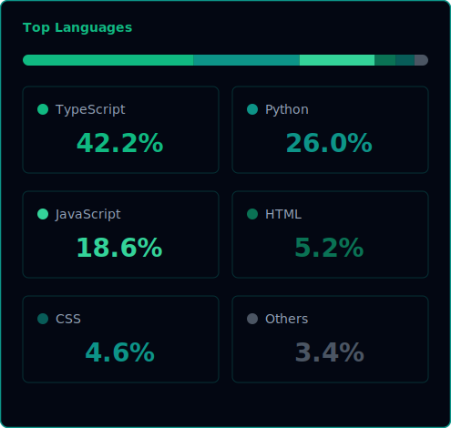

# Hi there, I'm Mahyudeen Shahid! 👋

<!-- Theme-Sensitive Header Banner -->
<picture>
  <source media="(prefers-color-scheme: dark)" srcset="readmefile/dark.svg">
  <source media="(prefers-color-scheme: light)" srcset="readmefile/light.svg">
  
</picture>

 

## 🚀 About Me
I’m **Mahyudeen Shahid**, a Software Engineering student and Full-Stack Web Developer who builds impactful, high-performance web applications beyond simple landing pages, focusing on immersive and interactive experiences using **GSAP, Framer Motion, Three.js, and Spline**. 

I work with **React, Next.js, MERN stack, and Supabase**, combining creative frontend development with strong backend functionality to build scalable full-stack solutions. I’m also passionate about **AI and automation**, building AI agents and workflows using tools like **n8n**, and I have experience deploying applications across Netlify, Vercel, DigitalOcean, AWS, Google Cloud, Azure, and Hostinger.

- 🎓 **Education:** B.S. in Software Engineering, Pakistan.
- 💬 **Ask me about:** Creative development, full-stack architectures, or automated AI agent workflows.
- ✉️ **Contact:** [mahyudeenjutt@gmail.com](mailto:mahyudeenjutt@gmail.com)
- 🌐 **Portfolio:** [mahyudeen.netlify.app](https://mahyudeen.netlify.app)

---

## 🛠️ Technical Skills

### 🖥️ Frontend & Creative

### ⚙️ Backend & API

### 🗄️ Databases & BaaS

### 🤖 AI & Automation

### ☁️ DevOps & Deployment

---

## 🏅 Holopin Badges

---

## 📈 GitHub Stats & Metrics

<!-- Sleek contribution activity graph -->

  

  <!-- Custom Color-Matched GitHub Stats -->
  
  
  <!-- Custom Color-Matched Top Languages -->
  

  <!-- GitHub Streak Stats -->
  

---

  Generated with 💚 using pure SVG &amp; SMIL animations.

